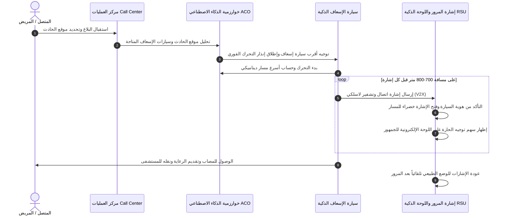

# 📑 الوثيقة التقنية الشاملة وفكرة مشروع PulseRoute™ (باللغة العربية)

> **اسم المشروع:** PulseRoute™ (PLR)  
> **الشعار:** سرعة استجابة فائقة • طرق ذكية • إنقاذ الأرواح (*Faster Response • Smarter Roads • Saving Lives*)  
> **المنافسة المستهدفة:** مسابقة HKUST العالمية لريادة الأعمال ($1M HKUST Entrepreneurship Competition)  
> **العام الأكاديمي:** 2026 / 2027  

---

## 📌 الفهرس العام
1. [الملخص التنفيذي للمشروع](#1-الملخص-التنفيذي-للمشروع)
2. [المشكلة الواقعية وأهمية الوقت](#2-المشكلة-الواقعية-وأهمية-الوقت)
3. [فكرة الحل ومنظومة PulseRoute](#3-فكرة-الحل-ومنظومة-pulseroute)
4. [رحلة البلاغ خطوة بخطوة](#4-رحلة-البلاغ-خطوة-بخطوة)
5. [شاشة السائق الذكية داخل عربة الإسعاف](#5-شاشة-السائق-الذكية-داخل-عربة-الإسعاف)
6. [آلية التواصل مع إشارات المرور (الـ V2X و RSU)](#6-آلية-التواصل-مع-إشارات-المرور)
7. [الابتكارات التقنية السبعة المميزة للمشروع](#7-الابتكارات-التقنية-السبعة-المميزة-للمشروع)
8. [الأمن السيبراني ومنع التلاعب والاختراق](#8-الأمن-السيبراني-ومنع-التلاعب-والاختراق)
9. [نموذج العمل التجاري وخطة الاستدامة المالية](#9-نموذج-العمل-التجاري-وخطة-الاستدامة-المالية)
10. [إجابات أسئلة لجنة التحكيم والمستثمرين (25 سؤال وجواب)](#10-إجابات-أسئلة-لجنة-التحكيم-والمستثمرين)
11. [فريق العمل والمهام](#11-فريق-العمل-والمهام)

---

## 1. الملخص التنفيذي للمشروع

مشروع **PulseRoute™** هو منظومة ذكية متكاملة لإدارة طوارئ الطرق وفتح مسارات خضراء آمنة وفورية لسيارات الإسعاف ومركبات الطوارئ عبر تقنيات الذكاء الاصطناعي، إنترنت الأشياء (IoT)، والاتصال المباشر بين المركبات والبنية التحتية (V2X).

الهدف الجوهري هو تقليص زمن استجابة سيارات الإسعاف من متوسط **30 دقيقة إلى أقل من 15 دقيقة** (خفض بنسبة 50%)، مما يساهم بشكل مباشر في إنقاذ حياة آلاف المرضى والمصابين سنوياً.

---

## 2. المشكلة الواقعية وأهمية الوقت

* في الحالات الحرجة (السكتات القلبية، النزيف الحاد، الحوادث الكبرى)، كل دقيقة تأخير تقلل فرصة نجاة المريض بنسبة تتراوح بين **7% إلى 10%**.
* الزحام المروري وإشارات المرور التقليدية غير المنسقة هما العائق الأكبر أمام سيارات الطوارئ.
* تطبيقات الخرائط الحالية (مثل Google Maps) تقتصر على إظهار الطرق المزدحمة فقط، لكنها **لا تستطيع التحكم في إشارات المرور أو إفساح الطريق فعلياً**.

---

## 3. فكرة الحل ومنظومة PulseRoute

المنظومة تربط بين أربعة أطراف في حلقة متصلة وفورية:
1. **غرفة العمليات المركزية (Call Center & Dispatch Engine)**
2. **سيارات الإسعاف (عبر الشاشة ووحدة التحكم الذكية OBU)**
3. **إشارات المرور واللوحات الإرشادية (وحدات RSU والشاشات التفاعلية)**
4. **السائقين والمواطنين على الطريق (عبر حارة الطوارئ الافتراضية)**

---

## 4. رحلة البلاغ خطوة بخطوة

---

## 5. شاشة السائق الذكية داخل عربة الإسعاف

تحتوي كابينة السائق على شاشة ذكية متقدمة تعرض في الوقت الفعلي:
1. **عدد الإشارات المتبقية** حتى الوصول لموقع البلاغ أو المستشفى.
2. **الوقت التنازلي التقديري (ETA)** للوصول.
3. **توقيت فتح كل إشارة** (Green Wave Clearance Countdown).
4. **المسار البديل الفوري** في حال حدوث أي طارئ أو عطل مفاجئ على الطريق.
5. **زر التحكم اليدوي المشفر** للتدخل عند اللزوم مع الحفاظ على معايير السلامة.

---

## 6. آلية التواصل مع إشارات المرور

* **مدى الاتصال:** يبدأ الجهاز داخل سيارة الإسعاف بالتواصل مع جهاز إشارة المرور (RSU) عند الاقتراب لمسافة **700 إلى 800 متر**.
* **التحكم التكيفي:** يقوم النظام بتحليل كثافة السيارات ويفتح الإشارة في الوقت المناسب بالضبط لضمان مرور الإسعاف دون توقف ودون إرباك حركة المرور لباقي الاتجاهات.
* **العودة التلقائية:** بمجرد عبور السيارة لنطاق الإشارة، تعود فوراً لبرمجتها المعتادة لتفريغ أي كثافة تراكمت في المسارات الأخرى.

---

## 7. الابتكارات التقنية السبعة المميزة للمشروع

### 1. تقنية مستعمرات النمل (Ant Colony Optimization - ACO)
تعتمد على محاكاة سلوك النمل في العثور على المسارات، لاختيار **أسرع مسار ديناميكي** وليس فقط أقصر مسار بالكيلومترات، مع التنبؤ المسبق بأماكن الاختناقات قبل الوصول إليها.

### 2. العلامة المائية الصوتية والتشفير المشفر للسرينة (Dynamic Acoustic Watermarking)
لمنع أي شخص من استخدام سرينة مزيفة أو تشغيل صوت الإسعاف للتلاعب بالإشارات، يتم تضمين إشارة صوتية غير مسموعة للأذن البشرية مشفرة بروتوكولياً داخل صوت السرينة، ويتم قراءتها عبر ميكروفونات ذكية في الإشارات بالتكامل مع مفاتيح RSA/AES.

### 3. تفريغ الشوارع الاستباقي وموجة المرور الصفرية (Zero-Traffic Corridor)
تنسيق سلسلة إشارات المرور على امتداد المسار وفتحها بتسلسل زمني مدروس (Green Wave) لتفريغ المربعات السكنية قبل وصول سيارة الإسعاف بـ 3 دقائق.

### 4. حارة الطوارئ الافتراضية (Virtual Emergency Lane)
شاشات LED ذكية على الإشارات تعرض أسهماً توجيهية (مثل سهم لأسفل للحارة الوسطى، أو يميناً/يساراً) لإرشاد السائقين لتفريغ حارة محددة وتجنب الارتباك وحوادث التصادم.

### 5. شبكة الطوارئ اللامركزية المقاومة للكوارث (Disaster Resilient Mesh Network)
في حال انقطاع شبكة الإنترنت أو الهواتف المحمولة وقت الكوارث والزلازل، تتحول الأجهزة في السيارات والإشارات تلقائياً إلى شبكة محلية لا سلكية (Ad-Hoc Mesh) تعمل باستقلالية تامة.

### 6. الملاحة الداخلية ثلاثية الأبعاد (3D Indoor Positioning)
نظام توجيه داخل المستشفيات والأنفاق والكباري ومواقف السيارات متعددة الطوابق بالاعتماد على إشارات البلوتوث منخفض الطاقة (BLE) ومستشعرات الحركة، لإرشاد المسعفين لغرف العمليات دون تأخير.

### 7. شبكة المستجيب الأول المجتمعي (First Responder Network)
تنبيه الأطباء والممرضين والمسعفين المتطوعين المتواجدين بالقرب من موقع البلاغ (في محيط 500 متر) لتقديم الإسعافات الأولية وتدليك القلب في أول 5 دقائق ذهبية لحين وصول السيارة.

---

## 8. الأمن السيبراني ومنع التلاعب والاختراق

* **بروتوكول Zero-Trust:** لا يتم قبول أي أمر لفتح الإشارة إلا بعد التحقق الثنائي من المفتاح المشفر للسيارة (Hardware Token) والترخيص الرسمي المصرح به من وزارة الصحة والداخلية.
* **الحماية من هجمات Replay Attacks:** استخدام أرقام غير قابلة للتكرار (Cryptographic Nonce) وصلاحية زمنية 30 ثانية لكل جلسة فتح إشارة.
* **قواعد الأمان المادية (Physical Failsafes):** يستحيل برمجياً إعطاء إشارة خضراء لاتجاهين متقاطعين في نفس الوقت، حيث تمنع دوائر الأمان الصلبة حدوث أي تعارض يؤدي إلى حوادث.

---

## 9. نموذج العمل التجاري وخطة الاستدامة المالية

1. **التعاقدات الحكومية المباشرة (B2G):** توريد وتشغيل المنظومة لهيئات الإسعاف وإدارات المرور والمدن الذكية.
2. **الاشتراكات الدورية للمستشفيات والقطاع الخاص (B2B SaaS):** باقات شهرية وسنوية لإدارة وتتبع أساطيل الإسعاف الخاصة.
3. **بيع وتحديث أجهزة الـ IoT والـ RSUs:** توريد وتركيب وحدات التحكم اللاسلكية للإشارات والسيارات.
4. **عقود الصيانة والدعم الفني السنوي (SLAs).**
5. **تحليلات بيانات المرور الذكية:** تقديم تقارير إحصائية دقيقة لوزارات النقل لتطوير تخطيط الطرق.

---

## 10. إجابات أسئلة لجنة التحكيم والمستثمرين

### س1: ما الذي يمنع وقوع حادث عند فتح الإشارة للإسعاف؟
> **ج:** النظام لا يفتح الإشارة فجأة وبشكل عشوائي، بل يعتمد على خوارزمية انتقال سلسة تحول الإشارات المعارضة للأصفر ثم الأحمر بأمان، مع تنبيه السائقين عبر اللوحات الإلكترونية قبل وصول الإسعاف بوقت كافٍ.

### س2: لماذا لا نكتفي ببرامج مثل Google Maps؟
> **ج:** جوجل ماب يقدم خدمة إرشاد وملاحة استرشادية فقط، ولا يستطيع التحكم في إشارات المرور أو التخاطب معها، ولا يضمن فتح حارة طوارئ، ولا يعمل بدون إنترنت في حالات الكوارث.

### س3: كيف يمكن تطبيق النظام في المدن ذات الإشارات القديمة؟
> **ج:** تم تصميم وحدات PulseRoute RSU بنظام التركيب الإضافي (Plug & Play Modular Retrofitting) الذي يتصل بمتحكمات الإشارات الحالية دون الحاجة لإعادة بناء البنية التحتية بالكامل.

### س4: هل المشروع مخصص لسيارات الإسعاف فقط؟
> **ج:** المنظومة مصممة لتكون قابلة للتوسع الفوري لتشمل سيارات الإطفاء والشرطة ومواكب الطوارئ وإدارات الحماية المدنية وفق مصفوفة أولويات ذكية.

---

## 11. فريق العمل والمهام

| العضو | الدور والمسؤولية | التخصص الهندسي |
|---|---|---|
| **مازن أحمد (Mazen Ahmed)** | قائد المنتج ومطور Full-Stack | تطوير الواجهات التفاعلية، بنية الأنظمة السحابية والـ WebSocket |
| **ياسين صبري العوامي (Yassen Sabry)** | مهندس البنية التحتية والـ Backend | تطوير محرك الـ Rust وربط قواعد بيانات Supabase والـ APIs |
| **أحمد حلمي العتر (Ahmed Helmy El-Etr)** | مهندس الذكاء الاصطناعي و ML | خوارزمية مستعمرات النمل ACO، تحليل تدفق المرور والرؤية الحاسوبية |
| **مي مجدي محمود (Mai Magdy)** | مسؤولة الأمن السيبراني واختبار الاختراق | التشفير الثنائي Zero-Trust، تأمين بروتوكولات الـ V2X ومنع التلاعب 

