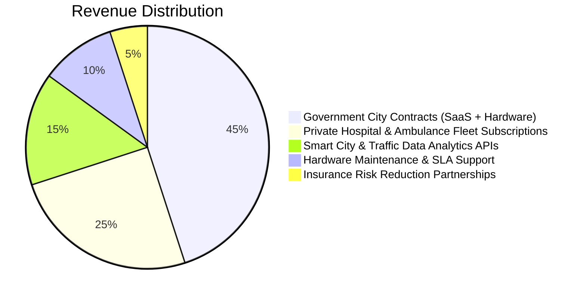

# 🏆 PulseRoute™ — HKUST $1M Entrepreneurship Competition Dossier

> **Project Name:** PulseRoute™ (PLR)  
> **Target Track:** Smart Cities & AI / IoT DeepTech Startups  
> **Competition:** HKUST One Million Dollar Entrepreneurship Competition  
> **Academic Year:** 2026/2027  
> **Motto:** *Faster Response • Smarter Roads • Saving Lives*

---

## 📋 Table of Contents
1. [Executive Summary](#1-executive-summary)
2. [The Problem: The "Golden Hour" Crisis](#2-the-problem-the-golden-hour-crisis)
3. [The PulseRoute Solution & Value Proposition](#3-the-pulseroute-solution--value-proposition)
4. [Competitive Advantage & Differentiation](#4-competitive-advantage--differentiation)
5. [Business Model & Monetization Strategy](#5-business-model--monetization-strategy)
6. [Market Sizing & Total Addressable Market (TAM)](#6-market-sizing--tam-sam-som)
7. [Go-to-Market Strategy & 5-Year Scaling Roadmap](#7-go-to-market-strategy--5-year-scaling-roadmap)
8. [Prototype & Demonstration Deliverables](#8-prototype--demonstration-deliverables)
9. [Team Composition & Execution Capabilities](#9-team-composition--execution-capabilities)
10. [Comprehensive Judge & Investor Q&A (25 Critical Defenses)](#10-comprehensive-judge--investor-qa)

---

## 1. Executive Summary

**PulseRoute™** is an autonomous cyber-physical emergency traffic preemption and AI telemetry platform. We integrate dispatch centers, emergency response vehicles, smart traffic lights, and connected infrastructure into a unified, zero-trust ecosystem.

By replacing passive GPS navigation with **active physical corridor clearing**, PulseRoute reduces urban emergency response times from an average of **30 minutes down to under 15 minutes** (a **50% reduction**), preventing thousands of avoidable fatalities each year.

---

## 2. The Problem: The "Golden Hour" Crisis

* **Urban Gridlock:** Rapid urbanization and dense vehicular traffic cause severe delays for emergency medical services (EMS), fire trucks, and police units.
* **The Fatal Delay:** Medical research confirms that every **60 seconds of delay** in trauma or cardiac arrest response reduces survival likelihood by **7% to 10%**.
* **Passive Navigation Limitations:** Modern tools (Google Maps, Waze) can only suggest congested routes; they have zero capability to physically preempt traffic signals or instruct civilian motorists to clear specific lanes.
* **Uncoordinated Infrastructure:** Municipal traffic lights operate on rigid, static timers or uncoordinated sensors, leading to dangerous intersection crossings where 40% of emergency vehicle collisions occur.

---

## 3. The PulseRoute Solution & Value Proposition

PulseRoute transforms urban corridors through an intelligent 4-tier pipeline:


### Key Pillars:
1. **Intelligent Dispatch & ETA Prediction:** AI selects the optimal vehicle based on real-time traffic density, proximity, and road telemetry.
2. **Ant Colony Optimization (ACO) Engine:** Computes the fastest dynamic path, taking into account intersection delays, signal timings, and historical congestion patterns.
3. **Pre-emptive Wave (700–800m Range):** Autonomous V2X communication alerts Road-Side Units (RSUs) on approaching traffic lights, creating a sequential **Zero-Traffic Corridor** before the vehicle arrives.
4. **Virtual Emergency Lane (VMS Road Signs):** Directional LED arrows instruct civilian motorists on which specific lane to clear, avoiding lane bottlenecks.
5. **Acoustic Watermarking & Cryptographic Siren Verification:** Prevents unauthorized signal override via RSA/AES handshake and sub-audible acoustic markers.

---

## 4. Competitive Advantage & Differentiation

| Feature / Metric | Standard GPS (Google Maps / Waze) | Legacy Optical Preemption (Opticom) | PulseRoute™ Intelligent System |
|---|---|---|---|
| **Route Guidance** | Passive (Observational) | None (Single intersection) | Active & Predictive (Corridor-wide) |
| **Signal Preemption** | ❌ None | Line-of-Sight Optical / Strobe | 360° Wireless V2X (700-800m Range) |
| **Civilian Instruction** | ❌ None | ❌ None | Smart VMS Signs with Directional Arrows |
| **Security & Anti-Spoofing** | N/A | High Vulnerability to Strobe Clones | AES/RSA Cryptographic Handshake |
| **Disaster Resilience** | Depends on Cellular Data | Standalone only | Decentralized Offline Mesh Network |
| **Multi-Vehicle Coordination**| None | First-Come-First-Serve | Priority-Weighted AI Queue |

---

## 5. Business Model & Monetization Strategy

PulseRoute employs a **B2G (Business-to-Government) & B2B (Business-to-Enterprise)** hybrid model:



1. **Municipal & Governmental Deployments:** Direct procurement contracts for city-wide smart traffic controller retrofits.
2. **SaaS Fleet Subscriptions:** Tiered monthly licensing for ambulance operators, police precincts, and fire departments.
3. **Hardware Modules & RSUs:** Turnkey IoT vehicle dongles and traffic light controller transceivers.
4. **Smart City Telemetry & Analytics:** Anonymized traffic flow optimization APIs sold to urban planners and transportation authorities.
5. **Insurance Partnerships:** Premium reduction incentives for emergency fleets utilizing certified zero-accident preemption tech.

---

## 6. Market Sizing (TAM, SAM, SOM)

* **TAM (Total Addressable Market):** **$38.5 Billion** — Global Smart Transportation and Intelligent Emergency Response Systems market by 2030.
* **SAM (Serviceable Addressable Market):** **$6.2 Billion** — V2X and emergency priority infrastructure across the Middle East, North Africa, and East Asia.
* **SOM (Serviceable Obtainable Market):** **$180 Million** — Initial 5-year target across target smart cities (Egypt New Administrative Capital, Cairo, Dubai, Riyadh, Hong Kong).

---

## 7. Go-to-Market Strategy & 5-Year Scaling Roadmap

```text
Year 1 (2026): Pilot Demonstration & Simulation Testing (5 Key Hospital Corridors)
Year 2 (2027): Commercial Launch in New Smart Cities & Tier-1 Municipal Fleet Integration
Year 3 (2028): Expansion into Fire and Police Services; Nationwide Highway Corridors
Year 4 (2029): Regional Expansion (MENA & GCC Smart Cities Deployment)
Year 5 (2030): Global Export to Asian & European Metropolises; Satellite-Linked Disaster Fleet
```

---

## 8. Prototype & Demonstration Deliverables

The competition prototype submission includes:
* **Interactive Rust/Axum Engine:** Real-time multi-threaded simulation server.
* **Command Center Dashboard:** Dynamic glassmorphic telemetry interface for call centers and fleet managers.
* **In-Vehicle Smart HUD:** Real-time cockpit screen displaying approaching signals, remaining time-to-green, and dynamic alternate routes.
* **Road-Side Unit (RSU) Hardware Simulator:** Demonstrating the 700m RF/V2X trigger, directional VMS lane clearance, and cryptographic verification.

---

## 9. Team Composition & Execution Capabilities

Our multidisciplinary 5-member team combines university academia with deep engineering competencies across hardware, AI, distributed backends, and cybersecurity:

* **Mazen Ahmed** — *Full-Stack Developer & Product Lead* (Distributed Web Architecture, Real-Time Telemetry, UI/UX State Machines)
* **Yassen Sabry Elawamy** — *Back-End & Cloud Systems Engineer* (Rust Core Architecture, PostgREST / Supabase Optimization, Distributed Microservices)
* **Ahmed Helmy El-Etr** — *AI & Machine Learning Engineer* (Ant Colony Optimization, Predictive Congestion Models, Computer Vision)
* **Mai Magdy Mahmoud** — *Cybersecurity & Penetration Tester* (Zero-Trust Cryptographic Handshakes, Threat Modeling, AES/RSA Authentication) 
---

## 10. Comprehensive Judge & Investor Q&A

### Q1: What happens if the AI makes an error or changes the traffic signal at the wrong time?
> **Answer:** PulseRoute operates under a **Fail-Safe Zero-Trust Architecture**. The AI does not have autonomous override authority without passing multi-layered safety guardrails. If any timing anomaly or conflict is detected, the traffic light reverts to standard safe amber-to-red clearing cycles. Furthermore, human operators in the vehicle maintain instant manual override.

### Q2: Why is Ant Colony Optimization (ACO) used instead of simple Dijkstra or A* algorithms?
> **Answer:** Traditional shortest-path algorithms calculate static geographical distances. Ant Colony Optimization models dynamic, real-time pheromone trails representing fluctuating traffic density, intersection delay probabilities, and road capacity. This ensures PulseRoute selects the **fastest dynamic time window**, not merely the shortest distance.

### Q3: How do you prevent malicious actors from spoofing sirens or faking emergency requests?
> **Answer:** PulseRoute eliminates reliance on audio siren sound. We implement a dual-verification system:
> 1. **Dynamic Acoustic Watermarking:** Sirens embed inaudible, rotating cryptographic audio signatures.
> 2. **Public-Key Cryptography (AES-256 + RSA-2048):** In-vehicle hardware exchanges cryptographically signed session tokens with Road-Side Units (RSUs) registered to municipal emergency rosters.

### Q4: How does the system handle complete internet or cellular outages during natural disasters?
> **Answer:** PulseRoute features an **Air-Gapped Decentralized Mesh Fallback**. When centralized cellular connectivity drops, RSUs and emergency vehicles form a direct peer-to-peer V2X mesh network (802.11p / DSRC). Signal preemption occurs locally without requiring internet access.

### Q5: What prevents civilian motorists from tailgating ambulances through preempted green lights?
> **Answer:** Intelligent roadside VMS displays show strict lane warning messages and dynamic speed camera triggers. The green window is calibrated precisely for the emergency vehicle's transit duration, immediately cycling back to normal phases once the rear axle clears the sensor zone.
