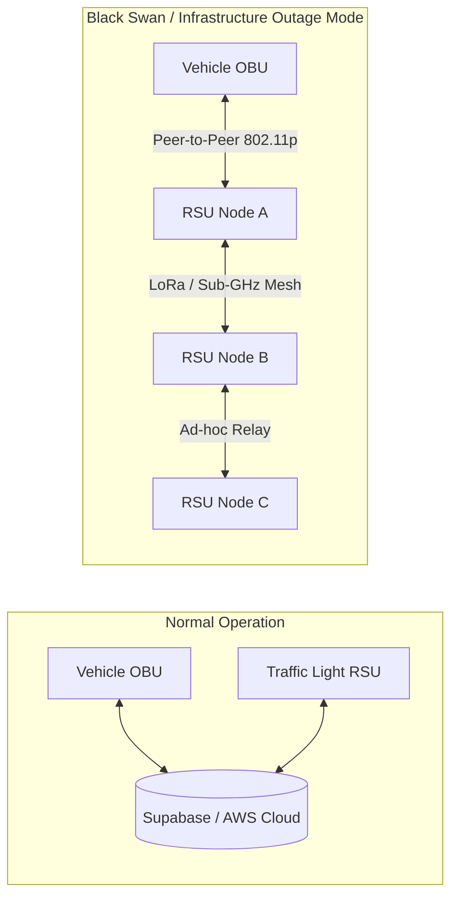

# 🛠️ PulseRoute™ — Deep Technical & System Architecture Specification

> **Classification:** Confidential Engineering & System Specification  
> **Version:** 2.4.0-Production  
> **Language Core:** Rust 2021 Edition (`tokio`, `axum`, `serde`, `utoipa`)  
> **Database:** PostgreSQL on Supabase + In-Memory Atomic Fallback  
> **Hardware Layer:** V2X RSU, In-Vehicle Cockpit HUD, FFT Acoustic Sensors

---

## 🏛️ High-Level System Architecture

```mermaid
graph TD
    subgraph Emergency Vehicle (OBU - On-Board Unit)
        OBU_GPS[GPS / GNSS Telemetry]
        OBU_HUD[Driver HUD & Route Guide]
        OBU_Radio[V2X Transceiver 5.9GHz]
        OBU_Audio[Acoustic Watermarking Modulator]
    end

    subgraph Road Infrastructure (RSU - Road-Side Unit)
        RSU_Mic[Directional Microphone Array + FFT]
        RSU_Rec[V2X Receiver & Crypto Validator]
        RSU_VMS[Variable Message Sign - VMS LED]
        RSU_PLC[Traffic Controller Interface / Preemption Relay]
    end

    subgraph Cloud Infrastructure (Supabase & Edge Rust Engine)
        API_GW[Vercel Serverless / Tokio Axum Gateway]
        ACO_Engine[Ant Colony AI Optimization Engine]
        DB_POSTGRES[(Supabase PostgreSQL + RLS)]
        FIRST_RESP[First Responder Crowdsourced Dispatch]
    end

    OBU_Radio -->|AES-256 / RSA Auth| RSU_Rec
    OBU_Audio -->|Sub-audible FSK Siren| RSU_Mic
    RSU_Rec --> RSU_PLC
    RSU_PLC --> RSU_VMS
    OBU_GPS -->|Cellular / Mesh| API_GW
    API_GW --> ACO_Engine
    API_GW --> DB_POSTGRES
    API_GW --> FIRST_RESP
```

---

## 📡 1. V2X & Physical Preemption Layer

### 1.1 Communication Range & Protocol
* **Band:** 5.850 GHz – 5.925 GHz (Dedicated Short-Range Communications / C-V2X).
* **Trigger Radius:** 700 to 800 meters ahead of the intersection.
* **Handshake Time:** `< 12 ms` round-trip.

```text
[Ambulance OBU]                                        [Traffic Light RSU]
      |                                                         |
      | --- 1. Broadcast Encrypted Preemption Beacon (700m) ---> |
      |     (Vehicle ID, Speed, Trajectory, Nonce, RSA-Sig)     |
      |                                                         |
      | <--- 2. Acknowledge & Challenge Token ----------------- |
      |                                                         |
      | --- 3. Cryptographic Signature Response ---------------> |
      |                                                         |
      |                                                [Validate Token]
      |                                                [Calculate Green Phase]
      |                                                [Trigger VMS Directional Arrows]
      |                                                [Cycle Conflicting Lights Red]
      |                                                         |
      | <--- 4. Preemption Confirmation + Green Window ETA ---- |
```

---

## 🔐 2. Anti-Spoofing & Cybersecurity Defense

### 2.1 Dynamic Acoustic Watermarking (DAW)
To eliminate spoofing from unauthorized sirens or audio playback devices:
1. The emergency siren emits standard audible frequencies ($500\text{ Hz} - 1.5\text{ kHz}$) for human hearing.
2. In-vehicle audio DSP injects a sub-audible high-frequency spread-spectrum watermark ($18.5\text{ kHz} - 21.0\text{ kHz}$) encoded using **Frequency-Shift Keying (FSK)**.
3. Road-Side Units (RSUs) equipped with digital microphone arrays perform continuous **Fast Fourier Transform (FFT)** analysis:
   $$\text{FFT}(x[n]) = \sum_{n=0}^{N-1} x[n] e^{-j 2 \pi k n / N}$$
4. The signal is verified against a rotating timestamped seed synchronized with municipal emergency dispatch.

### 2.2 Dual-Layer Cryptographic Handshake
* **Asymmetric Layer:** RSA-2048 / ECC P-256 for initial node authentication.
* **Symmetric Layer:** AES-256-GCM session tokens with 30-second TTL to prevent replay attacks.

---

## 🐜 3. Ant Colony Optimization (ACO) Path Routing Engine

Rather than relying on static Dijkstra shortest-path algorithms, PulseRoute applies an **Ant Colony Optimization (ACO)** metaheuristic modeled after biological ant foraging behavior:

### 3.1 Probability of Selecting Route Segment $(i, j)$:
$$P_{ij}^k(t) = \frac{[\tau_{ij}(t)]^\alpha \cdot [\eta_{ij}]^\beta}{\sum_{l \in \text{allowed}} [\tau_{il}(t)]^\alpha \cdot [\eta_{il}]^\beta}$$

Where:
* $\tau_{ij}(t)$ = Pheromone concentration (representing historical clearance efficiency and green-wave success rate).
* $\eta_{ij} = \frac{1}{\text{Delay}_{ij}}$ = Heuristic desirability (inverse of real-time congestion and red-light queue count).
* $\alpha, \beta$ = Influence weighting parameters ($\alpha = 1.2, \beta = 2.5$).

### 3.2 Dynamic Pheromone Update & Evaporation:
$$\tau_{ij}(t+1) = (1 - \rho)\tau_{ij}(t) + \sum_{k=1}^m \Delta \tau_{ij}^k$$
Where $\rho \in (0, 1]$ represents traffic decay rate, ensuring temporary traffic spikes do not poison future routing.

---

## 🚧 4. Virtual Emergency Lane & Roadside VMS Display

```text
+-------------------------------------------------------------+
|                      TRAFFIC LIGHT VMS                      |
|                                                             |
|           ⚠️  EMERGENCY VEHICLE APPROACHING (450M)           |
|                                                             |
|       [ LANE 1 ]          [ LANE 2 ]          [ LANE 3 ]    |
|         [ ⬅️ ]              [ ⬇️ ]              [ ➡️ ]     |
|       KEEP LEFT          CLEAR LANE           KEEP RIGHT    |
|                                                             |
|             ESTIMATED TIME TO INTERSECTION: 18 SEC          |
+-------------------------------------------------------------+
```

1. **Down-Arrow Indicator (`⬇️`):** Indicates the specific lane reserved for the oncoming ambulance.
2. **Side-Arrow Indicators (`⬅️` / `➡️`):** Instructs motorists in adjacent lanes to yield room without running red lights.

---

## 🌐 5. Disaster Resilience & Decentralized Mesh Fallback



* In the event of earthquake, severe weather, or telecom infrastructure collapse, PulseRoute nodes transition automatically into **Ad-Hoc Zero-Config Mesh Mode**.
* Local routing and preemption decisions are executed on edge hardware without reliance on external internet.

---

## 🏢 6. 3D Indoor & Tunnel Positioning Fallback

GPS signals degrade completely in multi-level basements, tunnels, and dense indoor hospital parking bays:
* **Micro-Location Engine:** Uses **BLE (Bluetooth Low Energy) RSSI trilateration** and **Wi-Fi 6 RTT (Fine Timing Measurement)**.
* **3D Map Synchronization:** Renders floor-by-floor navigation inside hospital complexes, directing EMS teams straight to trauma triage rooms without losing precious seconds.

---

## 🧑‍⚕️ 7. First Responder Crowdsourced Dispatch Integration

* When an emergency call is initiated, PulseRoute calculates the **Golden 5-Minute Window**.
* Certified off-duty doctors, nurses, and EMTs within a 500-meter radius receive an instantaneous push alert and turn-by-turn guidance to provide vital CPR / AED stabilization before the ambulance arrives on scene.
