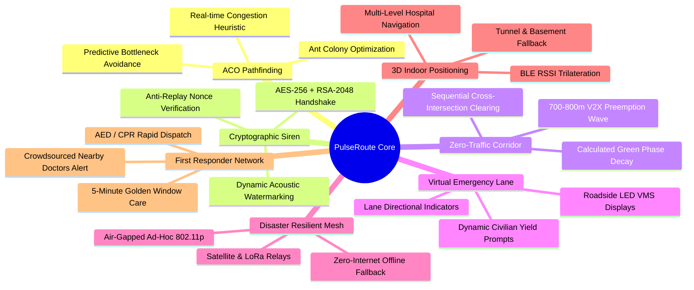

<div align="center">

# ⚡ PULSEROUTE™ (PLR)
### Autonomous Cyber-Physical Emergency Traffic Preemption & Deep AI Telemetry Engine

[](https://www.rust-lang.org/)
[](https://github.com/tokio-rs/axum)
[](https://supabase.com/)
[](docs/SYSTEM_ARCHITECTURE.md)
[](docs/SYSTEM_ARCHITECTURE.md#2-anti-spoofing--cybersecurity-defense)
[](docs/HKUST_COMPETITION_PITCH.md)
[](LICENSE)

<p align="center">
  <b>An enterprise-grade, memory-safe, cyber-physical platform orchestrating autonomous emergency green waves, dynamic traffic signal preemption, cryptographic siren verification, and real-time cloud telemetry.</b>
</p>

[English Overview](#-executive-summary--problem-statement) •
[العربية (الملخص العربي)](#-ملخص-المشروع-باللغة-العربية) •
[Core Innovations](#-7-breakthrough-innovations) •
[V2X Architecture](#-cyber-physical-system-architecture) •
[Hardware & IoT](#-hardware--in-vehicle-cockpit-hud) •
[HKUST Competition Pitch](docs/HKUST_COMPETITION_PITCH.md) •
[Arabic White Paper](docs/ARABIC_WHITE_PAPER.md) •
[System Specs](docs/SYSTEM_ARCHITECTURE.md) •
[The Team](#-the-innovators)

---

</div>

## 🌌 Executive Summary & Problem Statement

Urban emergency response efficiency is critically compromised by severe traffic congestion, uncoordinated signal timing, and passive GPS navigation tools. Every **60-second delay** in trauma, stroke, or cardiac arrest response reduces survival likelihood by **7–10%**.

* Current average ambulance round-trip duration in congested metropolises: **~30 Minutes**.
* **PulseRoute™ Target**: **Under 15 Minutes** (**>50% Response Time Reduction**).

**PulseRoute™** bridges the physical gap between emergency vehicles and city infrastructure. Built with an asynchronous, high-concurrency **Rust** backend, it converts static urban roads into an autonomous, safe **Zero-Traffic Corridor** by communicating with traffic lights (RSUs) **700–800 meters ahead**, verified with cryptographic tokens and sub-audible acoustic watermarks.

---

## 🇸🇦 ملخص المشروع باللغة العربية

> **PulseRoute™** هي منظومة متكاملة لربط سيارات الإسعاف بإشارات المرور وغرفة العمليات المركزية بالاعتماد على خوارزميات الذكاء الاصطناعي وإنترنت الأشياء (IoT) والاتصال اللاسلكي المباشر (V2X).  
> تهدف المنظومة لتقليص زمن وصول الإسعاف بنسبة **50%** (من 30 دقيقة إلى 15 دقيقة)، مما ينقذ حياة آلاف المرضى في الحالات الحرجة.

📖 **لقراءة الوثيقة الكاملة وفكرة المشروع وإجابات لجنة التحكيم باللغة العربية:**  
👉 **[تصفح الوثيقة التقنية الشاملة باللغة العربية (docs/ARABIC_WHITE_PAPER.md)](docs/ARABIC_WHITE_PAPER.md)**

---

## 🌟 7 Breakthrough Innovations



1. **Ant Colony Optimization (ACO) Engine:** Biomimetic routing optimizing for the fastest dynamic clearance window rather than static distance.
2. **Dynamic Acoustic Watermarking & Dual-Crypto Verification:** Siren audio embeds inaudible high-frequency FSK spread spectrum signals validated alongside public-key RSA tokens, completely preventing siren spoofing.
3. **Pre-emptive Wave (700–800m V2X Range):** Early wireless trigger to Road-Side Units (RSUs) granting seamless green corridors without sudden braking.
4. **Virtual Emergency Lane (VMS Smart Signage):** Overhead road signs project dynamic directional arrows (`⬇️`, `⬅️`, `➡️`) instructing motorists precisely which lane to vacate.
5. **Air-Gapped Disaster Mesh Network:** In severe grid failures or earthquakes, vehicles and roadside lights switch automatically to decentralized peer-to-peer mesh.
6. **3D Indoor & Multi-Level Mapping:** Bluetooth Low Energy (BLE) micro-positioning guiding paramedics directly to hospital triage and subterranean basements where GPS drops.
7. **First Responder Crowdsourced Alert:** Instant alerts sent to certified off-duty doctors and nurses within 500m to administer CPR in the critical first 5 minutes.

---

## 🏛️ Cyber-Physical System Architecture

```text
┌──────────────────────────────────────────────────────────────────────────────────┐
│                            1. ON-BOARD UNIT (OBU)                                │
│   ┌─────────────────────────────┐       ┌────────────────────────────────────┐   │
│   │   In-Cabin Cockpit HUD      │       │   5.9GHz V2X Radio Transceiver     │   │
│   │   • ETA & Signal Countdown  │       │   • AES-256 / RSA Encrypted Beacon │   │
│   │   • Dynamic Reroute Advice  │       │   • Sub-Audible Watermarked Audio  │   │
│   └──────────────┬──────────────┘       └─────────────────┬──────────────────┘   │
└──────────────────┼────────────────────────────────────────┼──────────────────────┘
                   │ GPS Telemetry / 4G / 5G / Mesh         │ 700m Direct Wireless
                   ▼                                        ▼
┌──────────────────────────────────────────────────────────────────────────────────┐
│                          2. ROAD-SIDE INFRASTRUCTURE (RSU)                       │
│   ┌──────────────────────────────────────────────────────────────────────────┐   │
│   │   Road-Side Unit (RSU) at Traffic Intersections                          │   │
│   │   • Directional Microphone Array + Real-Time FFT Acoustic Processing    │   │
│   │   • Traffic Light Controller Interface (Preemption Relays)               │   │
│   │   • Variable Message Signs (VMS LED) with Directional Arrow Prompts      │   │
│   └──────────────────────────────────┬───────────────────────────────────────┘   │
└──────────────────────────────────────┼───────────────────────────────────────────┘
                                       │ Real-time Telemetry & API Sync
                                       ▼
┌──────────────────────────────────────────────────────────────────────────────────┐
│                       3. CLOUD BACKEND & COMMAND DISPATCH                        │
│   ┌───────────────────────────────┐       ┌──────────────────────────────────┐   │
│   │   High-Concurrency Rust Axum  │       │   Supabase PostgreSQL Cloud      │   │
│   │   • Ant Colony Engine (ACO)   │       │   • Row-Level Security (RLS)     │   │
│   │   • Multi-Threaded Dispatch   │       │   • Real-Time Geo-Location Logs  │   │
│   │   • OpenAPI 3.0 / Swagger UI  │       │   • Incident History & Storage   │   │
│   └───────────────────────────────┘       └──────────────────────────────────┘   │
└──────────────────────────────────────────────────────────────────────────────────┘
```

---

## 📟 Hardware & In-Vehicle Cockpit HUD

Inside each emergency response unit, the driver is guided by a tactical cockpit HUD:

```text
+-------------------------------------------------------------+
| PULSEROUTE COCKPIT HUD                  [LIVE CORRIDOR]     |
| STATUS: EMERGENCY PRIORITY ACTIVE                           |
|                                                             |
|   NEXT TRAFFIC LIGHT:     MAIN ST. INTERSECTION             |
|   DISTANCE TO SIGNAL:     450 METERS                        |
|   SIGNAL STATUS:          PREEMPTION CONFIRMED (GREEN)      |
|   REMAINING SIGNALS:      3 INTERSECTIONS TO DESTINATION   |
|   ESTIMATED TIME (ETA):   2 MIN 14 SEC                      |
|                                                             |
|   RECOMMENDED LANE:       [ CENTER LANE (LANE 2) ]          |
|   FAIL-SAFE OVERRIDE:     [ MANUAL OVERRIDE ENGAGED: OFF ]  |
+-------------------------------------------------------------+
```

---

## 📂 Repository Topology

```text
e:\back tem\
├── 📂 docs/                          # Comprehensive Technical & Pitch Dossiers
│   ├── HKUST_COMPETITION_PITCH.md   # HKUST $1M Pitch Deck, Business Model & FAQ
│   ├── SYSTEM_ARCHITECTURE.md       # Deep V2X, Crypto, ACO Math & Hardware Specs
│   └── ARABIC_WHITE_PAPER.md        # وثيقة المشروع والمواصفات الكاملة باللغة العربية
├── 📂 src/                           # Enterprise Rust Backend Engine
│   ├── main.rs                      # Axum Server Entry Point & Graceful Shutdown
│   ├── lib.rs                       # Core Library, Router & OpenAPI Specification
│   ├── config.rs                    # Strongly-Typed Environment Configuration
│   ├── errors.rs                    # RFC 7807 Problem Details Error Subsystem
│   ├── state.rs                     # Dependency-Injected Application State
│   ├── domain/                      # Domain Entities & Value Objects
│   │   ├── mod.rs
│   │   └── team_member.rs           # TeamMember Domain Model
│   ├── dto/                         # Data Transfer Objects & Validation
│   │   ├── mod.rs
│   │   └── team_dto.rs              # Request/Response Validation DTOs
│   ├── repository/                  # Database Layer & PostgREST Client
│   │   ├── mod.rs
│   │   └── supabase_repo.rs         # Supabase Gateway with In-Memory Fallback
│   ├── service/                     # Business Logic Layer
│   │   ├── mod.rs
│   │   └── team_service.rs          # Team Operations, Sorting & Media Handling
│   └── handlers/                    # HTTP Controllers
│       ├── mod.rs
│       ├── team_handlers.rs         # Team REST CRUD Endpoints
│       └── health_handlers.rs       # System Health Check Controller
├── 📂 api/                          # Vercel Serverless Function Endpoints
│   ├── team.rs                      # Serverless Team Dispatcher
│   └── health.rs                    # Serverless Liveness Probe
├── 📂 public/                       # Front-End Perimeter & Assets
│   ├── index.html                   # PulseRoute Official Interactive Portal
│   ├── styles.css                   # Cyber-Aesthetic Design System
│   ├── app.js                       # Frontend Dynamics & Starfield Simulation
│   ├── team-loader.js               # Reactive Client API Synchronizer
│   └── admin/                       # Modern Glassmorphic Admin Dashboard
│       ├── index.html               # Control Center Interface
│       ├── admin.css                # Dark-Mode Glassmorphism Stylesheet
│       └── admin.js                 # Real-Time CRUD Controller
├── 📄 supabase_schema.sql           # Production Database Migration & RLS Security
├── 📄 vercel.json                   # Unified Edge Routing & Serverless Spec
├── 📄 Cargo.toml                    # Rust Package & Build Configuration
└── 📄 README.md                     # Master Documentation
```

---

## ⚡ RESTful API Reference

| Method | Route | Description | Auth Required |
|---|---|---|---|
| `GET` | `/api/v1/team` | Fetch active team members sorted by `display_order` | Public |
| `GET` | `/api/v1/team?all=true` | Fetch all member records including hidden items | Admin Secret |
| `GET` | `/api/v1/team/{id}` | Fetch individual member profile by UUID | Public |
| `POST` | `/api/v1/team` | Create new team member with schema validation | Admin Secret |
| `PUT` | `/api/v1/team/{id}` | Update member profile and permissions | Admin Secret |
| `DELETE` | `/api/v1/team/{id}` | Delete member record permanently | Admin Secret |
| `POST` | `/api/v1/team/reorder` | Batch update display ordering | Admin Secret |
| `POST` | `/api/v1/team/upload` | Multipart avatar file upload to Supabase bucket | Admin Secret |
| `GET` | `/api/v1/health` | Comprehensive infrastructure health & uptime probe | Public |

---

## 👥 The Innovators

<div align="center">

| Engineer | Role | Engineering Domain |
|---|---|---|
| **Mazen Ahmed** | Product Lead & Full-Stack Engineer | Distributed Web Architecture, Real-Time UI/UX, WebSocket Telemetry |
| **Yassen Sabry Elawamy** | Backend & Cloud Systems Lead | Rust Concurrency, Database Design, Serverless Architecture, REST APIs |
| **Ahmed Helmy El-Attar** | AI & Machine Learning Lead | Ant Colony Optimization (ACO), Predictive Traffic, Computer Vision |
| **Mai Magdy Mahmoud** | Cybersecurity & Penetration Tester | Zero-Trust Networks, Cryptographic Handshakes, Threat Modeling |

</div>

---

## 🚀 Quickstart & Local Execution

### 1. Prerequisites
* [Rust 1.80+](https://rustup.rs/)
* [Git](https://git-scm.com/)

### 2. Setup & Run
```bash
# Clone the repository
git clone https://github.com/teem28090-cyber/Pulse-Route.git
cd Pulse-Route

# Configure environment keys
cp .env.example .env

# Run the local server engine
cargo run --bin server
```

### 3. Access Portals
* **Main Cyber-Portal:** `http://localhost:8080`
* **Admin Command Center:** `http://localhost:8080/admin`
* **Live OpenAPI / Swagger Docs:** `http://localhost:8080/swagger-ui`
* **Raw Team API Endpoint:** `http://localhost:8080/api/v1/team`

---

<div align="center">
  <sub>Developed with pride by the <b>PulseRoute Engineering Team</b> for Global Innovation & Life-Saving Technology.</sub><br>
  <sub>© 2026 PulseRoute Technologies. All rights reserved.</sub>
</div>
